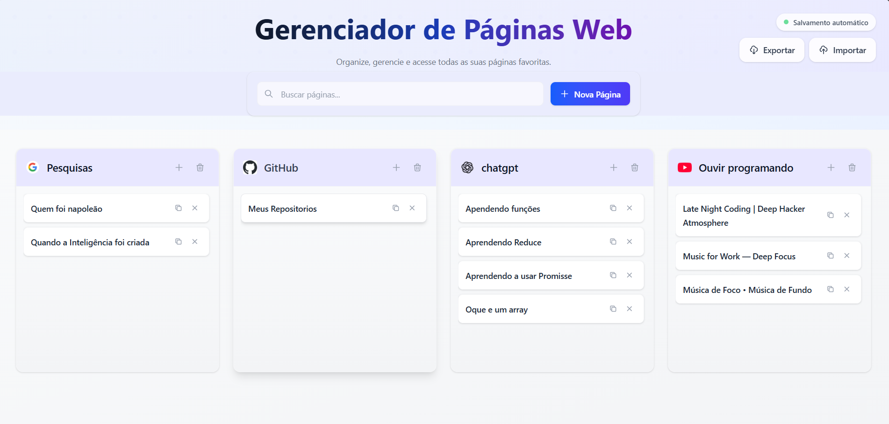
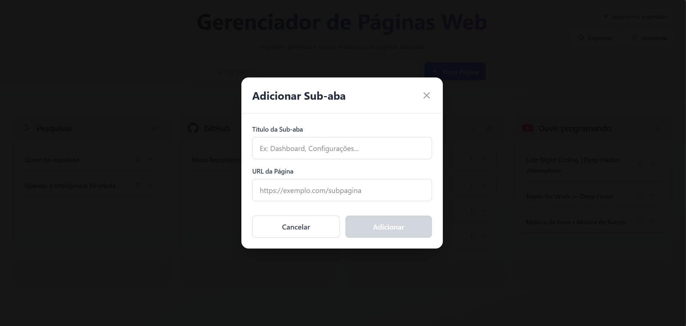

# 🌐 Gerenciador de Páginas Web

Um gerenciador moderno e intuitivo para organizar e acessar suas páginas web favoritas. Criado com React, Vite e TailwindCSS para uma experiência de usuário fluida e responsiva.

## ✨ Características

- **Interface Moderna**: Design limpo e responsivo com Tailwind CSS
- **Organização por Categorias**: Organize suas páginas por YouTube, LinkedIn, GitHub, Google e outras
- **Busca Rápida**: Sistema de busca em tempo real para encontrar páginas facilmente
- **Sub-abas Personalizadas**: Adicione múltiplas abas para cada página principal
- **Salvamento Automático**: Todos os dados são salvos automaticamente no navegador
- **Exportar/Importar**: Faça backup e restaure suas configurações
- **Favicons Automáticos**: Exibição automática dos ícones dos sites
- **Copiar URLs**: Copie links para a área de transferência com um clique

## 🚀 Tecnologias Utilizadas

- **Frontend**: React 19 + Vite
- **Estilização**: TailwindCSS 4.1
- **Armazenamento Local**: localStorage para persistência
- **Linting**: ESLint com regras modernas

## 📦 Instalação

1. Clone o repositório:

```bash
git clone https://github.com/seu-usuario/gerenciador-de-paginas.git
cd gerenciador-de-paginas
```

2. Instale as dependências:

```bash
npm install
```

3. Execute o projeto em modo desenvolvimento:

```bash
npm run dev
```

4. Abra [http://localhost:5173](http://localhost:5173) no seu navegador.

## 🔧 Scripts Disponíveis

- `npm run dev` - Inicia o servidor de desenvolvimento

## 📱 Funcionalidades

### Adicionar Páginas

- Clique no botão "Nova Página"
- Preencha o título e URL
- A página será salva automaticamente com favicon

### Gerenciar Sub-abas

- Cada página pode ter múltiplas sub-abas
- Adicione links relacionados ou seções específicas
- Organize melhor seus recursos

### Busca e Filtros

- Use a barra de busca para encontrar páginas rapidamente
- Filtragem em tempo real por título

### Exportar/Importar

- **Exportar**: Salve todas suas configurações em um arquivo JSON
- **Importar**: Restaure suas páginas de um backup anterior

## 💾 Armazenamento

O projeto utiliza localStorage para persistir dados localmente:

## 🛠️ Estrutura do Projeto

```
src/
├── components/          # Componentes reutilizáveis
│   ├── Modal.jsx       # Modal para adicionar páginas
│   └── ModalExclusao.jsx # Modal de confirmação de exclusão
├── hooks/              # Custom hooks
│   └── useHome.js      # Lógica principal da aplicação
├── pages/              # Páginas da aplicação
│   └── Home.jsx        # Página principal
├── assets/             # Recursos estáticos
├── App.jsx             # Componente principal
├── main.jsx           # Ponto de entrada
└── index.css          # Estilos globais
```

## 🖼️ Galeria de Imagens

- **Pagina Inicial**

  

- **Adicionar Nova Aba**

  

- **Adicionar Sub-Aba**

  

## Autor: Elisson
